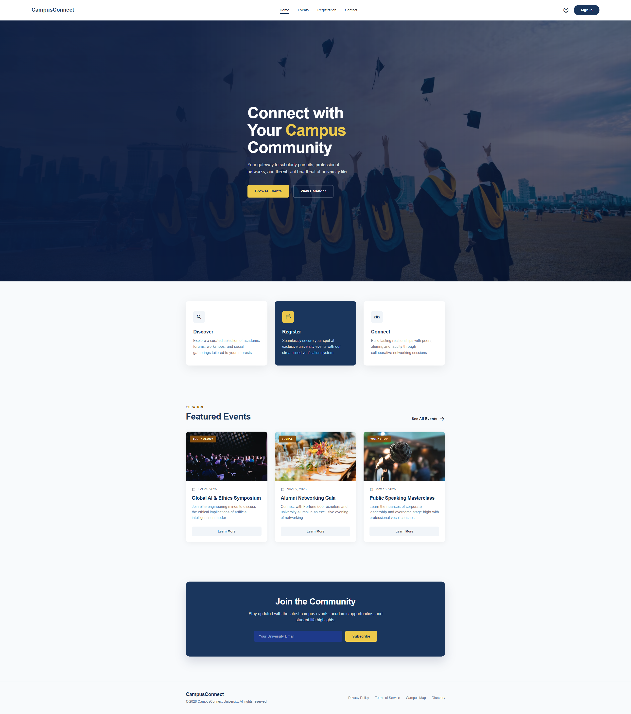
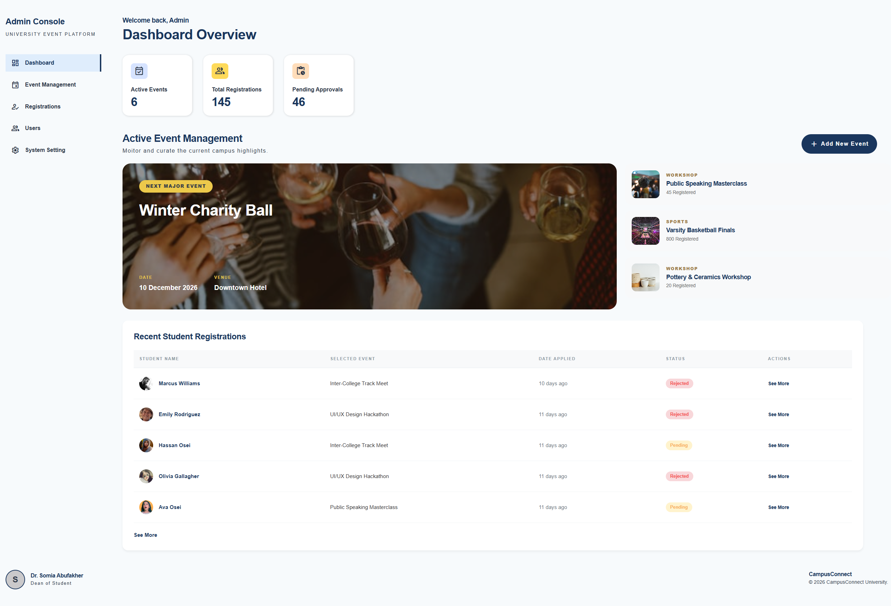
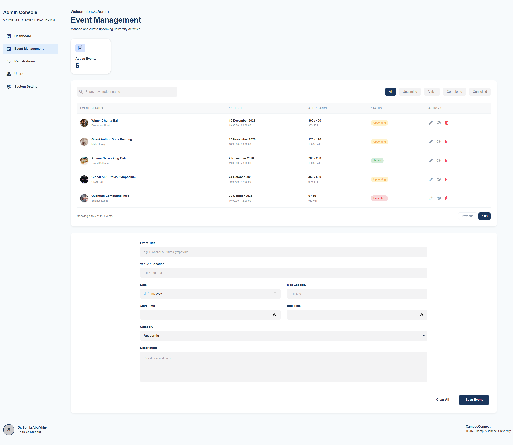
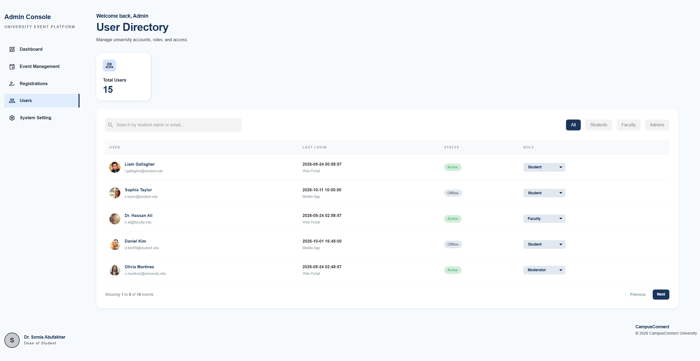

<div align="center">
  <h1>🎓 CampusConnect</h1>
  <p>A dynamic, server-side University Event Management Platform built with PHP & MySQL.</p>
  
  
  
  
  
</div>

<br />

## 📖 About The Project

**CampusConnect** is a comprehensive web application designed to bridge the gap between students discovering campus activities and administrators managing event registrations. 

Originally built as a static frontend project, it has been successfully migrated to a **fully dynamic Server-Side architecture** using PHP and MySQL. This migration enables real-time data handling, server-side pagination, dynamic filtering, and a fully functional Admin Dashboard.

### ✨ Key Features
- **Dynamic Admin Dashboard:** Track total users, active events, and pending registrations in real-time.
- **Server-Side Data Processing:** Efficient data fetching with built-in MySQL `LIMIT` and `OFFSET` for pagination.
- **Advanced Filtering & Search:** Filter events and users by status, role, or search queries directly through database queries (No JS array manipulation).
- **Automated Setup:** A built-in database migration and seeder script to populate the platform with dummy data instantly.
- **Modular Architecture:** Clean separation of concerns (Configuration, Models, View Pages, and Database logic).

---

## 📸 Project Showcase

Here is a glimpse of the platform's user interface and admin capabilities:

<div align="center">
  
  <br><em>CampusConnect Landing Page</em><br><br>
  
  
  <br><em>Admin Dashboard - Real-time Statistics</em><br><br>

  
  <br><em>Admin Console - Event Management with Dynamic Pagination</em><br><br>
  
  
  <br><em>Admin Console - User Role Management</em>
</div>

---

## 🚀 Getting Started (Installation Guide)

Follow these instructions to set up the project locally on your machine. This guide assumes you are using a local server environment like **XAMPP**, WAMP, or MAMP.

### Prerequisites
- PHP (v7.4 or higher)
- MySQL Database
- XAMPP (Recommended for Windows/Mac)

### 1. Clone the Repository
Clone the project into your local server's root directory (e.g., `C:\xampp\htdocs\` for XAMPP):
```bash
git clonehttps://github.com/JoudN2001/Campus-Connect.git
```
## 2. Database Configuration

Before running the application, you need to configure the database credentials.

1. Open your **XAMPP Control Panel** and start **Apache** and **MySQL**.

2. Open your browser and navigate to:

```
http://localhost/phpmyadmin/
```

3. Create a new empty database named:

```
campus_connect
```

4. In your code editor, open the file:

```
config/db.php
```

5. Ensure the credentials match your local MySQL setup (default XAMPP configuration uses `root` with no password):

```php
$db_server = "localhost";
$db_user = "root";       // Change if your DB username is different
$db_pass = "";           // Change if your DB has a password
$db_name = "campus_connect";
```

---

## 3. Load Dummy Data (Automated Setup)

You do **not** need to import SQL files manually. The project includes an automated setup script that creates the required tables and populates them with realistic dummy data.

1. Open your web browser.

2. Navigate to the setup file:

```
http://localhost/Campus-Connect/database/setup.php
```

3. You should see a success message similar to:

```
System Setup Started...
Tables created successfully...
Setup Complete!
```

> **Note:** You only need to run this file once.

---

## 4. Run the Application

Once the database has been configured and populated, you can access the platform:

### Public Interface

```
http://localhost/Campus-Connect/src/pages/home-page.php
```

### Admin Dashboard

```
http://localhost/Campus-Connect/src/pages/admin/dashboard.php
```

---

# 📁 Repository Structure

```text
Campus-Connect/
├── config/             # Database connection credentials (db.php)
├── database/           # Database schema creation and dummy data seeder (setup.php)
├── images/             # UI screenshots for documentation
├── includes/           # PHP models (DB queries) and helper functions
├── src/
│   ├── pages/          # Public PHP views (Home, Events, Contact, Registration)
│   │   └── admin/      # Admin PHP views (Dashboard, Users, Manage Events)
│   └── stylesheet/     # CSS styling and global variables
└── README.md
```

---

# 👥 Meet the Team

This project was built collaboratively by our dedicated team:

* **Joud N.**
* **Mamoun Momani**
* **Ramiz Aboramadan**

---

# 🙏 Acknowledgments

A special thank you to **Dr. Somia Abufakher** for her continuous guidance, valuable feedback, and support throughout the semester, helping make this project a reality.
